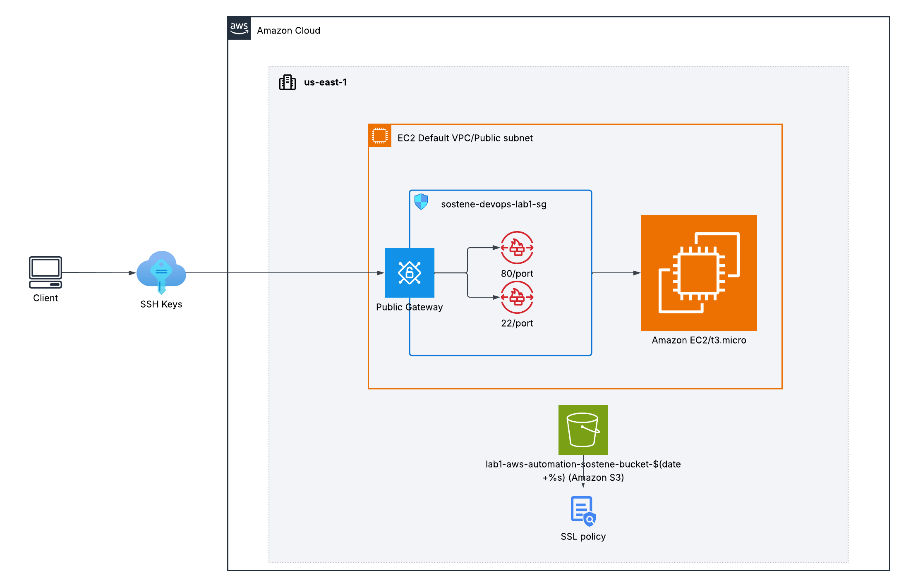
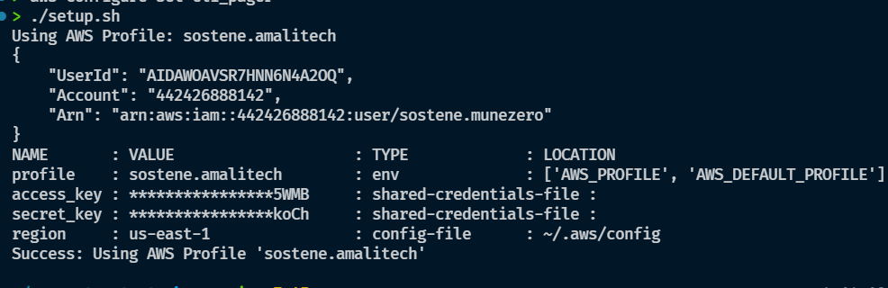
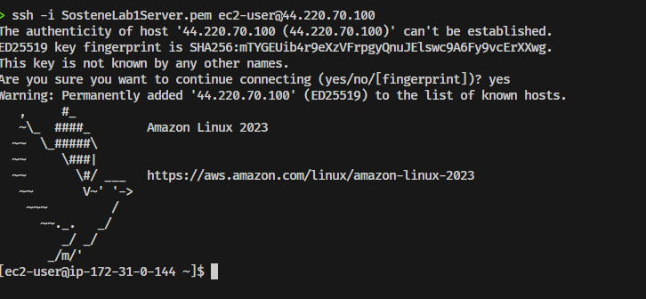

# Project: Automate AWS Resource Creation with Bash

I developed this project using Bash scripts and the AWS CLI to automate the creation and cleanup of AWS resources like EC2 instances, Security Groups, and S3 buckets.

## Architecture Diagram

Below is the high-level architecture diagram representing the AWS resources provisioned by these automation scripts:



This architecture represents the resources managed by the scripts:
- **Client & SSH Keys**: A local workstation authenticating with the EC2 instance using the generated key pair (`SosteneLab1Server.pem`).
- **Public Gateway**: Provides entry into the AWS VPC/Public Subnet.
- **AWS Security Group (`sostene-devops-lab1-sg`)**: Acts as a stateful firewall, permitting inbound SSH traffic on port `22` and web traffic on port `80`.
- **Amazon EC2 (`t3.micro`)**: The compute instance deployed in the public subnet.
- **Amazon S3 (`lab1-aws-automation-sostene-bucket-$(date +%s)`)**: A dynamically named S3 bucket in `us-east-1` containing the uploaded `welcome.txt` file, secured by versioning and a custom bucket policy.

---

## Purpose of Each Script

*   **[create_ec2.sh](./create_ec2.sh)**: 
    *   Creates a new EC2 key pair.
    *   Creates a new EC2 instance using a free-tier Amazon Linux 2 AMI.
    *   Tags the key pair and the instance with `Owner=sostene` and `Project=sostene-lab1-aws-automation`.
    *   Prints the instance ID and public IP upon creation.
*   **[create_security_group.sh](./create_security_group.sh)**: 
    *   Creates a security group named `sostene-devops-lab1-sg` and tags it with `Owner=sostene` and `Project=sostene-lab1-aws-automation`.
    *   Opens port 22 for SSH access and port 80 for HTTP traffic.
    *   Assigns the security group to the created EC2 instance.
    *   Displays the security group ID and rules.
*   **[create_s3_bucket.sh](./create_s3_bucket.sh)**: 
    *   Creates a uniquely named S3 bucket.
    *   Tags the S3 bucket with `Owner=sostene` and `Project=sostene-lab1-aws-automation`.
    *   Enables versioning and sets a simple bucket policy.
    *   Uploads a sample text file (`welcome.txt`) to the bucket.
*   **[cleanup_resources.sh](./cleanup_resources.sh)**: 
    *   Terminates the EC2 instance and waits for it to stop.
    *   Deletes the EC2 key pair and the local `.pem` file.
    *   Deletes the security group.
    *   Deletes all object versions and delete markers from the S3 bucket, then deletes the bucket itself.
    *   Prioritizes deleting resources using IDs/names from `.env`, falling back to tag-based discovery (`Owner=sostene` and `Project=sostene-lab1-aws-automation`) if needed.

### Optional Helper Scripts 
*   **[setup.sh](./setup.sh)**:
    *   Verifies that the AWS CLI is installed.
    *   Validates that `AWS_PROFILE` is set.
    *   Checks if an AWS CLI pager is configured and advises to disable it.
    *   Prints environment identity details and configurations.
*   **[run_create.sh](./run_create.sh)**:
    *   Runs the setup and three creation scripts in order.

---

## Setup and Execution Steps

### Setup and Verify AWS CLI Environment
I configure and verify the AWS CLI setup by running the setup script:
```bash
./setup.sh
```
**setup.sh execution output**



### Run the Scripts to Create Resources
I run this command to create the EC2 instance, security group, and S3 bucket, saving the output in a log file:
```bash
./run_create.sh > create.log
```
The creation output and details are recorded inside the `create.log` file.

### Test that the Security Group is Working
I test that the security group is working by connecting to the server via SSH:
```bash
ssh -i $KEY_NAME.pem ec2-user@$PUBLIC_IP
```
The results are shown in this screenshot:


### Clean Up Resources
I run this command to delete all created resources and avoid AWS costs:
```bash
./cleanup_resources.sh > cleanup.log
```
The cleanup output and details are recorded inside the `cleanup.log` file.

---

## Challenges Faced

During the development of this project, I encountered a couple of key challenges:
- **Sharing Variables Across Scripts**: Since the creation process is broken into modular scripts (`create_ec2.sh`, `create_security_group.sh`, `create_s3_bucket.sh`), it was difficult to share dynamically generated resource identifiers (like `INSTANCE_ID`, `KEY_NAME`, `SECURITY_GROUP_ID`, and `BUCKET_NAME`) between them. This was resolved by appending these variables to a local `.env` file that is sourced by subsequent scripts.
- **Keeping Track of Resources**: Deleting resources in the correct sequence was crucial because they depend on each other (e.g., a Security Group cannot be deleted while it is still associated with a running EC2 Instance). To ensure a clean state even if the `.env` file is missing, the cleanup script was enhanced with tag-based discovery (`Owner=sostene` and `Project=sostene-lab1-aws-automation`) to identify and tear down the resources reliably.
- **Resource Naming Conventions**: Devising naming schemes for all created resources (Key Pair, Security Group, S3 Bucket) that clearly identify their purpose, scope, and ownership to anyone inspecting the AWS console was a challenge. Implementing consistent prefixes and unique identifiers (e.g. `sostene-devops-lab1-sg` and `lab1-aws-automation-sostene-bucket-$(date +%s)`) helped address this.
