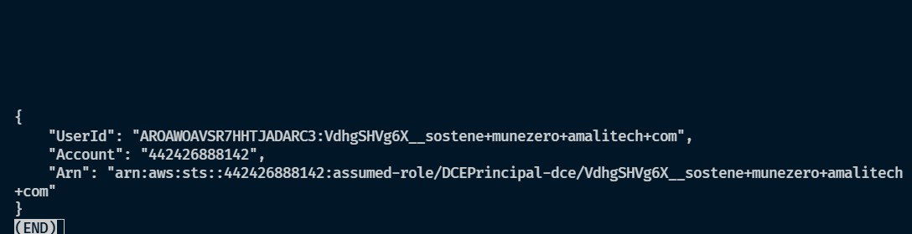
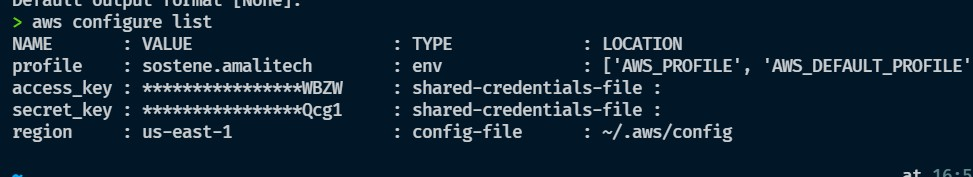
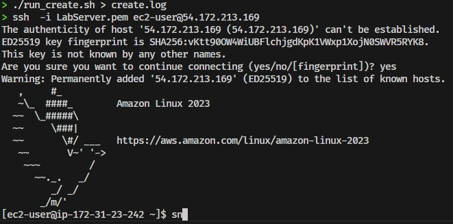

# Project: Automate AWS Resource Creation with Bash

I developed this project using Bash scripts and the AWS CLI to automate the creation and cleanup of AWS resources like EC2 instances, Security Groups, and S3 buckets.

---

## 1. Purpose of Each Script

*   **[create_ec2.sh](./create_ec2.sh)**: 
    *   Creates a new EC2 key pair.
    *   Creates a new EC2 instance using a free-tier Amazon Linux 2 AMI.
    *   Tags the instance with `Project=AutomationLab`.
    *   Prints the instance ID and public IP upon creation.
*   **[create_security_group.sh](./create_security_group.sh)**: 
    *   Creates a security group named `devops-sg`.
    *   Opens port 22 for SSH access and port 80 for HTTP traffic.
    *   Assigns the security group to the created EC2 instance.
    *   Displays the security group ID and rules.
*   **[create_s3_bucket.sh](./create_s3_bucket.sh)**: 
    *   Creates a uniquely named S3 bucket.
    *   Enables versioning and sets a simple bucket policy.
    *   Uploads a sample text file (`welcome.txt`) to the bucket.
*   **[run_create.sh](./run_create.sh)**:
    *   Runs the three creation scripts (`create_ec2.sh`, `create_security_group.sh`, and `create_s3_bucket.sh`) in order.
*   **[cleanup_resources.sh](./cleanup_resources.sh)**: 
    *   Terminates the EC2 instance and waits for it to stop.
    *   Deletes the EC2 key pair and the local `.pem` file.
    *   Deletes the security group.
    *   Deletes all object versions and delete markers from the S3 bucket, then deletes the bucket itself.

---

## 2. Setup and Execution Steps

### Step 1: Setup and Verify AWS CLI Environment
I configure and verify the AWS CLI setup by running:
```bash
aws sts get-caller-identity
aws configure list
```
**aws sts get-caller-identity output**


**aws configure list output**


### Step 2: Make the Scripts Executable
I run this command to give execution permissions to the scripts:
```bash
chmod +x *.sh
```

I recommend to  disable AWS pager before running the scripts

```bash
aws configuration set pager ""
```

### Step 3: Run the Scripts to Create Resources
I run this command to create the EC2 instance, security group, and S3 bucket, saving the output in a log file:
```bash
./run_create.sh > create.log
```
You can check the creation output and details inside the `create.log` file.

### Step 4: Test that the Security Group is Working
I test that the security group is working by connecting to the server via SSH:
```bash
ssh -i $KEY_NAME.pem ec2-user@$PUBLIC_IP
```
The results are shown in this screenshot:


### Step 5: Clean Up Resources
I run this command to delete all created resources and avoid AWS costs:
```bash
./cleanup_resources.sh > cleanup.log
```
You can check the cleanup output and details inside the `cleanup.log` file.
